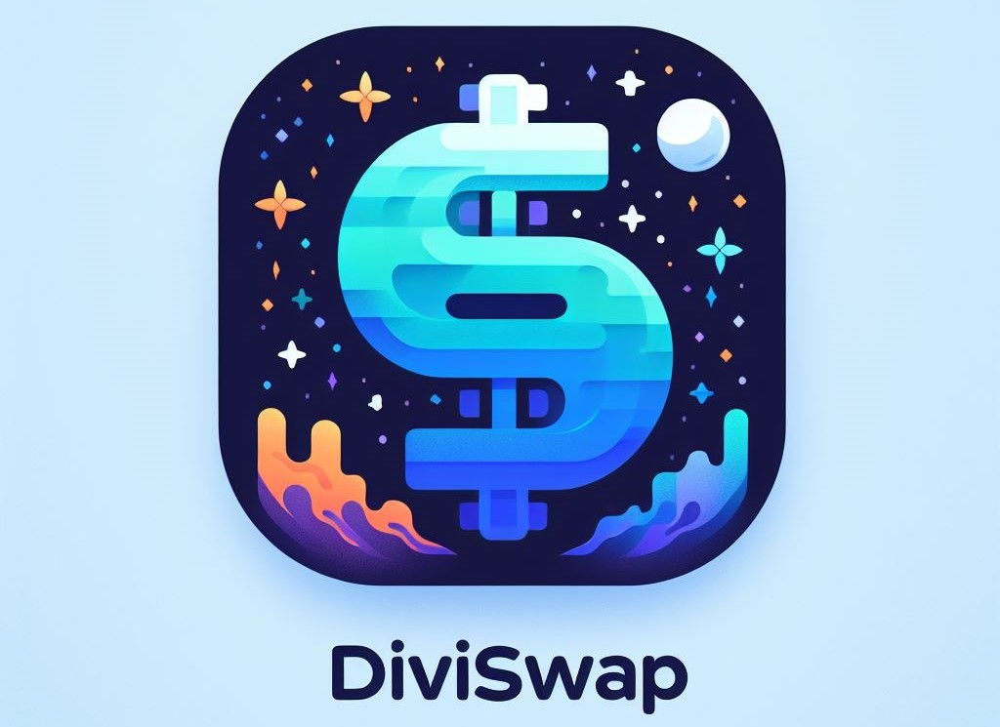
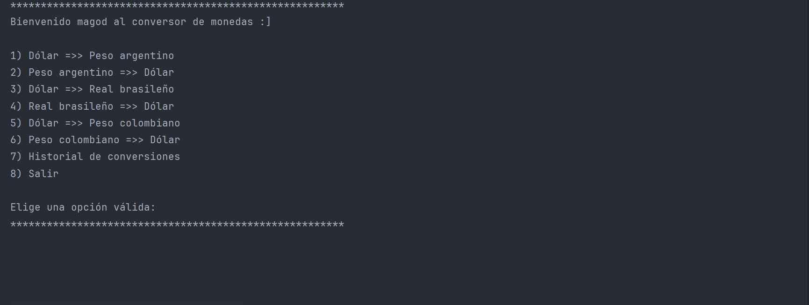

<header style="display: flex; flex-direction: column; justify-content: center; align-items: center">
<h1 align="center">DiviSwap</h1>
<h1 align="center">

</h1>
</header>
<main>
<ul style="display:flex; flex-direction: column; gap: .5rem; list-style: none; padding: 0; margin-top: 50px">
<li>
<a href="#description" style="display: inline; align-items: center; gap: .5rem; text-decoration: none">
👍 
Descripción del proyecto
</a>
</li>
<li>
<a href="#state" style="display: inline; align-items: center; gap: .5rem; text-decoration: none">
👍 
Estado del proyecto
</a>
</li>
<li>
<a href="#functions" style="display: inline; align-items: center; gap: .5rem; text-decoration: none">
👍 
Demostración de funciones
</a>
</li>
<li>
<a href="#projects" style="display: inline; align-items: center; gap: .5rem; text-decoration: none">
👍 
Acceso al proyecto
</a>
</li>
<li>
<a href="#technologies" style="display: inline; align-items: center; gap: .5rem; text-decoration: none">
👍 
Tecnologías utilizadas
</a>
</li>
<li>
<a href="#state" style="display: inline; align-items: center; gap: .5rem; text-decoration: none">
👍 
Autor del proyecto
</a>
</li>
</ul>
<section id="description">
<h2>🚀 Descripción del proyecto</h2>

Este proyecto es un desafío propuesto por Alura Latam Challenges, nuestro conversor de monedas <strong>DiviSwap</strong> realiza solicitudes a una API de tasas de cambio, filtra y muestra las monedas de interés para el usuario según la opción seleccionada en el menú de la aplicación de consola. Las monedas soportadas al momento incluyen el dolár (USD), peso argentino (ARS), real brasileño (BRL), peso colombiano (COP)

</section>
<section id="state">
<h2>✔️ Estado del proyecto</h2>
<h4 align="center">
:checkered_flag: Proyecto finalizado :checkered_flag:
</h4>
</section>
<section id="functions">
<h2>🔨 Demostración de funciones</h2>
<ol>
<li>Conversión de monedas</li>

Realiza la conversión de monedas : "USD =>> ARS, ARS =>> USD, USD =>> BRL, BRL =>> USD, USD =>> COP, COP =>> USD".

<li>Historial de conversiones</li>

Guarda el historial de las conversiones realizadas por el usuario.

</ol>

</section>
<section id="projects">
<h2>📁 Acceso al proyecto</h2>

Puedes acceder al proyecto siguiendo los pasos:

<ol>
<li>Clona el repositorio con git clone 
<a href="#">https://github.com/KonectaPe/diviswap.git</a>
</li>
<li>
Descarga la libreria Gson 2.10.1 en formato JAR e integralo en IntelliJ Idea <a href="">https://mvnrepository.com/artifact/com.google.code.gson/gson/2.10.1</a>
</li>
<li>Ejecuta el main y verás la magia.</li>
</ol>
</section>
<section id="technologies">
<h2>✌️ Tecnología utilizadas</h2>

Las tecnologías utilizadas en el proyecto:

<h3 align="center">

</h3>

<h3 align="center">

</h3>

</section>
<section id="technologies">
<h2>🧔 Autor del proyecto</h2>
<h3 style="padding: 0; margin: 0">

</h3>
<a href="https://github.com/KonectaPe/KonectaPe" target="_blank">
Deyver JM
</a>
</section>
</main>
<footer>
</footer>

